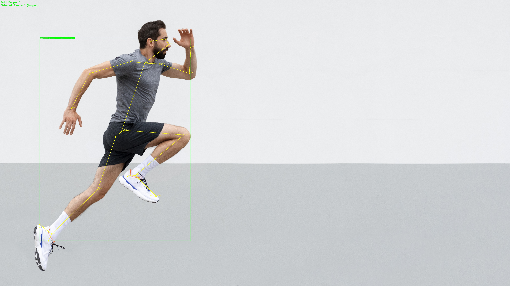
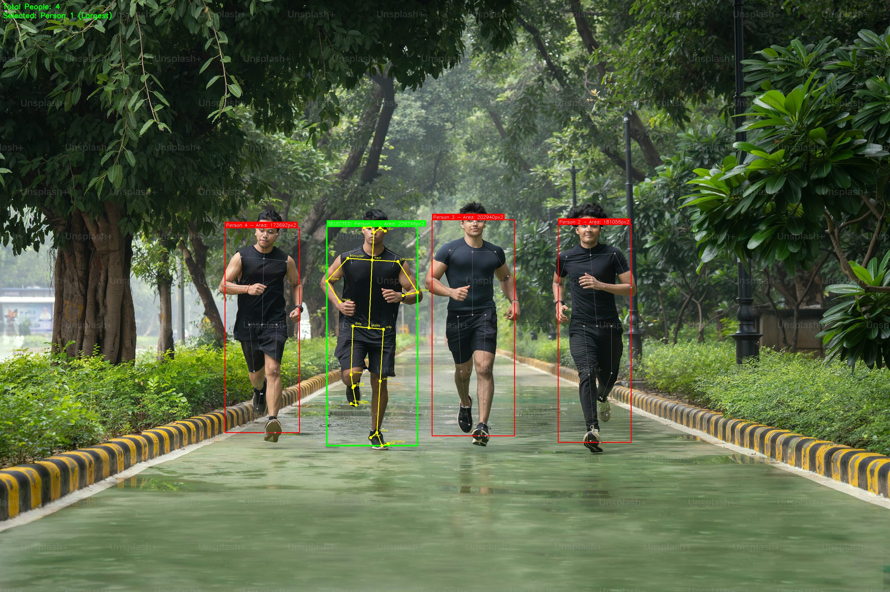

# Image-to-Pose Reinforcement Learning for Humanoid Walking

This project builds a reinforcement learning pipeline where a humanoid agent learns to walk from image-defined body poses.

The workflow is:

1. Use OpenPose `BODY_25` to detect human keypoints from input images.
2. Select the main person in multi-person images using the largest bounding box.
3. Convert the selected skeleton into a compact joint-angle pose vector.
4. Use that pose vector to reset a PyBullet humanoid environment.
5. Train a DQN-based agent in a Gymnasium-style environment to produce walking behavior.

The repository includes:

- OpenPose-based pose extraction code
- Pose-to-angle conversion utilities
- A URDF humanoid and PyBullet walking environment
- DQN and Dueling DQN training code
- Training checkpoints and training statistics

## 1. Project Structure

```text
.
├── pose/
│   ├── image.py                  # Image load/save helpers
│   ├── keypoints.py              # OpenPose BODY_25 extraction
│   └── angles.py                 # Skeleton -> pose vector conversion
├── env/
│   ├── humanoid.urdf             # Humanoid model
│   └── walk_env.py               # PyBullet walking environment
├── agent/
│   ├── network.py                # DQN / Dueling DQN networks
│   ├── replay.py                 # Replay buffers
│   ├── train_dqn.py              # Main training entry point
│   ├── test_trained_agent.py     # Evaluation / playback
│   └── generate_pose_libarary.py # Pose library generation
├── data/
│   ├── input_images/             # Input photos for pose extraction
│   ├── output_image/             # Extracted pose outputs
│   └── poses/                    # Saved pose library files
├── checkpoints/                  # Default training checkpoints
├── checkpoints_tuned/            # Tuned training checkpoints
├── test_pose.py                  # Batch image -> pose pipeline
├── test_env.py                   # Environment validation script
├── fine_tuning.py                # Tuned training script
├── main.py                       # Full demo pipeline
└── requirement.txt               # Python dependencies
```

## 2. Recommended Platform

The current code is written and configured primarily for:

- Windows
- Python 3.7
- OpenPose built from source with CMake
- PyBullet for physics simulation

Important: `pose/keypoints.py` currently expects OpenPose at:

```text
C:\openpose
```

If your OpenPose installation is in a different location, update `OPENPOSE_DIR` inside [pose/keypoints.py](/D:/project/pose/keypoints.py).

## 3. Installation

### 3.1 Create a Python 3.7 environment

```powershell
py -3.7 -m venv .venv
.\.venv\Scripts\activate
python -m pip install --upgrade pip
```

### 3.2 Install Python packages

Install from the project dependency file first:

```powershell
pip install -r requirement.txt
```

Because the environment code imports `gymnasium`, also install:

```powershell
pip install gymnasium
```

If PyTorch wheels for Python 3.7 differ on your machine, install the correct CPU or CUDA build manually from the official PyTorch selector, then re-run the remaining packages.

## 4. OpenPose Setup

This project uses the OpenPose Python API through `pyopenpose`.

### 4.1 Install prerequisites

Typical Windows build prerequisites:

- Visual Studio with C++ build tools
- CMake
- CUDA and cuDNN if building GPU OpenPose
- OpenCV dependencies required by OpenPose

### 4.2 Build OpenPose with CMake

Expected high-level process:

1. Clone OpenPose.
2. Configure it with CMake.
3. Build the project in Visual Studio or with CMake build tools.
4. Enable the Python API during the build.
5. Confirm the following folders exist under `C:\openpose`:

```text
C:\openpose\build\python\openpose\Release
C:\openpose\build\python\openpose
C:\openpose\build\x64\Release
C:\openpose\build\bin
C:\openpose\3rdparty\caffe\bin
C:\openpose\models
```

The code appends these paths automatically in [pose/keypoints.py](/D:/project/pose/keypoints.py).

### 4.3 Verify OpenPose import

Run:

```powershell
python test_pose.py --help
```

If OpenPose DLL loading fails, the most common reasons are:

- Python version mismatch with the built OpenPose Python bindings
- `OPENPOSE_DIR` points to the wrong folder
- missing DLLs in the OpenPose `bin` or `Release` folders

## 5. End-to-End Pipeline

### Step 1: Add input images

Put input images in:

```text
data/input_images/
```

Supported formats are `.jpg`, `.jpeg`, `.png`, `.bmp`, and `.tiff`.

### Step 2: Extract poses from images

Run the batch pipeline:

```powershell
python test_pose.py
```

For a single image:

```powershell
python test_pose.py --single data/input_images\sample.jpg
```

For each image, the pipeline:

1. loads the image
2. detects all people with OpenPose `BODY_25`
3. computes a bounding box for each detected person
4. selects the largest person
5. converts the selected skeleton into a pose vector
6. saves outputs for later RL training

Generated files go to:

```text
data/output_image/
```

Expected outputs per image:

- `imageN_keypoints.jpg`
- `imageN_pose_vector.npy`
- `imageN_pose_vector.txt`
- `imageN_metadata.json`

### Step 2 Results

Example outputs from the pose extraction stage:

**Single-person result**



**Multi-person result with largest-person selection**



### Step 3: Optionally build a pose dataset

To aggregate extracted pose vectors into a single dataset:

```powershell
python test_pose.py --dataset data/output_image data/datasets/pose_vectors.npz
```

This creates a compressed `.npz` file containing:

- `X`: pose vectors
- `filenames`: source filenames

### Step 4: Validate the simulation environment

Run:

```powershell
python test_env.py
```

This script checks:

- URDF loading
- dynamic joint discovery
- reset with custom pose
- random-action stepping
- basic image-to-environment integration

### Step 5: Train the walking agent

Recommended training command:

```powershell
python agent\train_dqn.py --pose-dir data/output_image --episodes 150 --max-steps 2000 --save-freq 30 --log-freq 5 --prefill-rollouts 300 --prefill-steps 50 --dueling --save-dir checkpoints
```

What happens during training:

1. the environment loads the humanoid URDF in PyBullet
2. pose vectors from `data/output_image` are loaded as initial states
3. replay buffer warm-start rollouts are optionally collected
4. a Dueling DQN policy is trained using epsilon-greedy exploration
5. checkpoints and statistics are saved periodically

Saved outputs:

- model checkpoints in `checkpoints/`
- training stats JSON files in `checkpoints/`
- final model at `checkpoints/dqn_final.pth`

### Step 6: Run the tuned training variant

If you want to use the alternate reward weights and hyperparameters:

```powershell
python fine_tuning.py
```

Outputs are saved in:

```text
checkpoints_tuned/
```

### Step 7: Test a trained agent

Evaluate the default trained model:

```powershell
python agent\test_trained_agent.py --model checkpoints\dqn_final.pth --episodes 5
```

Run without GUI:

```powershell
python agent\test_trained_agent.py --model checkpoints\dqn_final.pth --episodes 5 --no-render
```

Compare a trained model across several initial poses:

```powershell
python agent\test_trained_agent.py --model checkpoints\dqn_final.pth --compare-poses
```

## 6. Complete Data Flow

The full pipeline can be summarized as:

```text
Input image
  -> OpenPose BODY_25 keypoints
  -> largest-person selection
  -> joint-angle pose vector
  -> initial humanoid joint configuration
  -> PyBullet simulation
  -> DQN interaction loop
  -> trained walking policy
```

In repository terms:

```text
data/input_images/*
  -> test_pose.py
  -> pose/keypoints.py
  -> pose/angles.py
  -> data/output_image/*_pose_vector.npy
  -> agent/train_dqn.py
  -> env/walk_env.py
  -> checkpoints/dqn_final.pth
```

## 7. Core Components

### Pose extraction

[pose/keypoints.py](/D:/project/pose/keypoints.py)

- loads OpenPose Python bindings
- runs BODY_25 pose estimation
- handles multi-person detection
- selects the main person using largest bounding-box area
- can render annotated keypoint images

### Pose vector conversion

[pose/angles.py](/D:/project/pose/angles.py)

- uses selected BODY_25 joints
- converts limb directions into angles with `atan2`
- returns a compact pose vector used to initialize the humanoid

### Physics environment

[env/walk_env.py](/D:/project/env/walk_env.py)

- Gymnasium-style environment
- loads `env/humanoid.urdf`
- discovers controllable joints dynamically
- applies torque-based control
- computes reward from forward velocity, alive bonus, and energy penalty

### RL agent

[agent/train_dqn.py](/D:/project/agent/train_dqn.py), [agent/network.py](/D:/project/agent/network.py), and [agent/replay.py](/D:/project/agent/replay.py)

- standard DQN and Dueling DQN support
- replay buffer and prioritized replay support
- target network updates
- epsilon-greedy exploration
- checkpointing and metric logging

## 8. Files Produced During Experiments

### Pose extraction outputs

- `data/output_image/*_keypoints.jpg`
- `data/output_image/*_pose_vector.npy`
- `data/output_image/*_pose_vector.txt`
- `data/output_image/*_metadata.json`

### Training outputs

- `checkpoints/dqn_episode_*.pth`
- `checkpoints/training_stats_*.json`
- `checkpoints/dqn_final.pth`
- `checkpoints/reward_curve.png`
- `checkpoints/loss_curve.png`
- `checkpoints/length_curve.png`

### Tuned training outputs

- `checkpoints_tuned/dqn_episode_*.pth`
- `checkpoints_tuned/training_stats_*.json`
- `checkpoints_tuned/dqn_optimized.pth`

## 9. Recommended Commands

```powershell
# 1. Extract poses from images
python test_pose.py

# 2. Validate environment
python test_env.py

# 3. Train agent
python agent\train_dqn.py --pose-dir data/output_image --dueling

# 4. Test trained model
python agent\test_trained_agent.py --model checkpoints\dqn_final.pth

# 5. Run tuned training
python fine_tuning.py
```

## 10. Known Notes About the Current Codebase

These are useful to know when reproducing results:

- OpenPose is hardcoded to `C:\openpose`.
- The dependency file is named `requirement.txt`, not `requirements.txt`.
- The environment imports `gymnasium`, so `gymnasium` must be installed even though `requirement.txt` currently lists `gym`.
- The most reliable current workflow is `test_pose.py` -> `agent/train_dqn.py` -> `agent/test_trained_agent.py`.
- Some demo scripts contain older path assumptions such as `data/images/...`; if that path does not exist on your machine, use `data/input_images/...` and the batch pipeline outputs in `data/output_image/`.

## 11. Suggested Reproduction Order

If you are setting this project up from scratch, use this order:

1. Build OpenPose with Python bindings.
2. Create a Python 3.7 environment.
3. Install dependencies from `requirement.txt` and `gymnasium`.
4. Update `OPENPOSE_DIR` if needed.
5. Place sample images in `data/input_images/`.
6. Run `python test_pose.py`.
7. Run `python test_env.py`.
8. Train with `python agent\train_dqn.py --pose-dir data/output_image --dueling`.
9. Evaluate with `python agent\test_trained_agent.py --model checkpoints\dqn_final.pth`.

## 12. Summary

This project connects computer vision and reinforcement learning in one pipeline:

- OpenPose extracts human body structure from images.
- Those poses become initialization signals for a humanoid simulator.
- A DQN agent learns control policies for walking from those pose-based starting states.

If you want, the next step I can help with is cleaning up the repo so the scripts and paths are fully consistent with this README.
